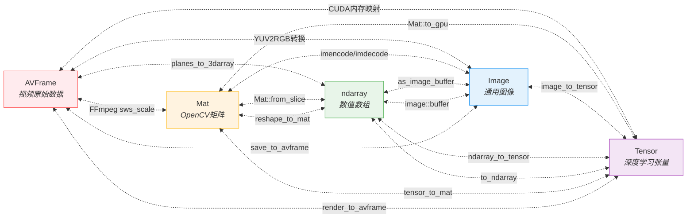
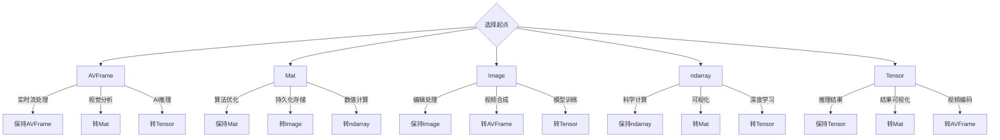

# cv-convert

Convert computer vision data types in Rust.

A fork of [jerry73204/rust-cv-convert](https://github.com/jerry73204/rust-cv-convert) that extends
the original crate with additional type conversions, notably FFmpeg (`AVFrame`) support.

## Supported crates

- [image](https://crates.io/crates/image)
- [imageproc](https://crates.io/crates/imageproc)
- [nalgebra](https://crates.io/crates/nalgebra)
- [ndarray](https://crates.io/crates/ndarray)
- [opencv](https://crates.io/crates/opencv)
- [rsmpeg](https://crates.io/crates/rsmpeg)
- [tch](https://crates.io/crates/tch)

## Concept


```mermaid
graph LR
%% 核心节点定义
AF[AVFrame<br><i>视频原始数据</i>]:::avframe
MA[Mat<br><i>OpenCV矩阵</i>]:::mat
IM[Image<br><i>通用图像</i>]:::image
ND[ndarray<br><i>数值数组</i>]:::ndarray
TE[Tensor<br><i>深度学习张量</i>]:::tensor

%% 转换路径矩阵
AF <-.->|FFmpeg sws_scale| MA
AF <-.->|YUV2RGB转换| IM
AF <-.->|planes_to_3darray| ND
AF <-.->|CUDA内存映射| TE

MA <-.->|Mat::from_slice| ND
MA <-.->|imencode/imdecode| IM
MA <-.->|Mat::to_gpu| TE

IM <-.->|image::buffer| ND
IM <-.->|image_to_tensor| TE
IM <-.->|save_to_avframe| AF

ND <-.->|ndarray_to_tensor| TE
ND <-.->|reshape_to_mat| MA
ND <-.->|as_image_buffer| IM

TE <-.->|to_ndarray| ND
TE <-.->|tensor_to_mat| MA
TE <-.->|render_to_avframe| AF

classDef avframe fill:#FFEBEE,stroke:#FF5252;
classDef mat fill:#FFF3E0,stroke:#FFB300;
classDef image fill:#E3F2FD,stroke:#2196F3;
classDef ndarray fill:#E8F5E9,stroke:#4CAF50;
classDef tensor fill:#F3E5F5,stroke:#9C27B0;
```

> 异常处理矩阵：

| 转换路径    | 可能异常         | 解决方案                             |
| ----------- | ---------------- | ------------------------------------ |
| AVFrame→Mat | 色彩空间不匹配   | 自动插入 sws_scale 转换上下文        |
| YUV→RGB     | 有限范围/色彩标准 | `ndarray` 走 yuvutils-rs，`rsmpeg` 走 ffmpeg sws_scale |
| Image→ndarray | 通道顺序差异(RGB vs BGR) | 提供 convert_channels 特性方法 |
| Mat→Tensor  | 内存对齐问题     | 使用 aligned_alloc 分配器            |


```mermaid
graph TD
Start{选择起点} --> A[AVFrame]
Start --> B[Mat]
Start --> C[Image]
Start --> D[ndarray]
Start --> E[Tensor]

A -->|实时流处理| F[保持AVFrame]
A -->|视觉分析| G[转Mat]
A -->|AI推理| H[转Tensor]

B -->|算法优化| I[保持Mat]
B -->|持久化存储| J[转Image]
B -->|数值计算| K[转ndarray]

C -->|编辑处理| L[保持Image]
C -->|视频合成| M[转AVFrame]
C -->|模型训练| N[转Tensor]

D -->|科学计算| O[保持ndarray]
D -->|可视化| P[转Mat]
D -->|深度学习| Q[转Tensor]

E -->|推理结果| R[保持Tensor]
E -->|结果可视化| S[转Mat]
E -->|视频编码| T[转AVFrame]
```

## Usage

By default the `image`, `imageproc`, `nalgebra` and `ndarray` features are enabled. Install the
crate (or fork) from git:

```toml
[dependencies]
cv-convert = { git = "https://github.com/phial3/cv-convert", branch = "main" }
```

To enable a specific set of converted crates, disable the default features and list the ones
you want:

```toml
[dependencies.cv-convert]
git = "https://github.com/phial3/cv-convert"
branch = "main"
default-features = false
features = [
    "image",
    "imageproc",
    "nalgebra",
    "ndarray",
    "opencv",
    "tch",
    "rsmpeg",
]
```

## Available Features

### Core library features

- `image` - Enable [image](https://crates.io/crates/image) crate support
- `imageproc` - Enable [imageproc](https://crates.io/crates/imageproc) crate support
- `nalgebra` - Enable [nalgebra](https://crates.io/crates/nalgebra) crate support
- `ndarray` - Enable [ndarray](https://crates.io/crates/ndarray) crate support (pulls in `yuvutils-rs` for YUV conversions)
- `opencv` - Enable [opencv](https://crates.io/crates/opencv) crate support
- `tch` - Enable [tch](https://crates.io/crates/tch) crate support
- `rsmpeg` - Enable [rsmpeg](https://crates.io/crates/rsmpeg) crate support

### Feature groups

- `default` - `image` + `imageproc` + `nalgebra` + `ndarray`
- `full` - `tch` + `opencv` + `rsmpeg`
- `test-tch` - `tch` with `download-libtorch` (used for tests)

### System dependencies

The following features require system libraries to be installed:

- `opencv` - OpenCV (linked via `clang-runtime`)
- `tch` - libtorch
- `rsmpeg` - FFmpeg (linked via `link_system_ffmpeg`)

## Examples

The crate provides `ToCv`, `TryToCv`, `AsRefCv`, `TryAsRefCv` traits, which are similar to the
standard library's `Into`, `TryInto`, `AsRef` and `TryAsRef`.

```rust,ignore,no_run
use cv_convert::{ToCv, TryToCv};
use nalgebra as na;
use opencv as cv;

// ToCv - infallible conversion
let cv_point = cv::core::Point2d::new(1.0, 3.0);
let na_point: na::Point2<f64> = cv_point.to_cv();

// ToCv - the other direction
let na_point = na::Point2::<f64>::new(1.0, 3.0);
let cv_point: cv::core::Point2d = na_point.to_cv();

// TryToCv - fallible conversion
let na_mat = na::DMatrix::from_vec(2, 3, vec![1.0, 2.0, 3.0, 4.0, 5.0, 6.0]);
let cv_mat = cv::core::Mat::try_to_cv(&na_mat)?;

// TryToCv - the other direction
let cv_mat = cv::core::Mat::from_slice_2d(&[&[1.0, 2.0, 3.0], &[4.0, 5.0, 6.0]])?;
let na_mat: na::DMatrix<f64> = cv_mat.try_to_cv()?;
```

## Contribute to this Project

### Add a new type conversion

To add a new type conversion, take `image::DynamicImage` and `opencv::Mat` for example. Proceed
to `cv-convert/src` and implement the code in `with_opencv_image.rs` because it is a conversion
among opencv and image crates.

Choose `ToCv` or `TryToCv` trait and add the trait implementation on `image::DynamicImage` and
`opencv::Mat` types. The choice of `ToCv` or `TryToCv` depends on whether the conversion is
fallible or not.

```rust
impl ToCv<opencv::Mat> for image::DynamicImage { /* omit */ }
impl ToCv<image::DynamicImage> for opencv::Mat { /* omit */ }

// or

impl TryToCv<opencv::Mat> for image::DynamicImage {
    type Error = SomeError;
    fn try_to_cv(&self) -> Result<opencv::Mat, Self::Error> { /* omit */ }
}
impl TryToCv<image::DynamicImage> for opencv::Mat {
    type Error = SomeError;
    fn try_to_cv(&self) -> Result<image::DynamicImage, Self::Error> { /* omit */ }
}

#[cfg(test)]
mod tests {
    // Write a test
}
```

## License

MIT license. See [LICENSE](LICENSE.txt) file.