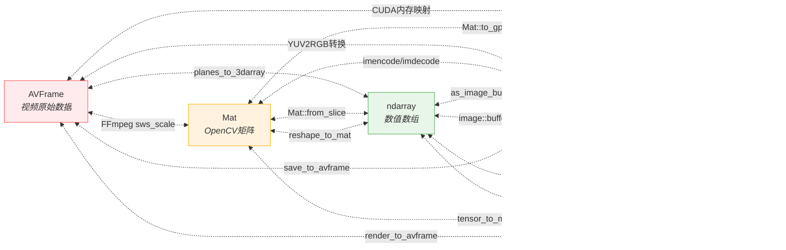

# cv-convert
Convert computer vision data types in Rust

reference: [jerry73204](https://github.com/jerry73204/rust-cv-convert)

## Concept



> 异常处理矩阵：
> 
| 转换路径 |	可能异常	|解决方案 |
|---------  | ------- | ------ |
AVFrame→Mat	    | 色彩空间不匹配	|自动插入sws_scale转换上下文
Image→ndarray   | 通道顺序差异(RGB vs BGR)	| 提供convert_channels特性方法
Mat→Tensor	    | 内存对齐问题	| 使用aligned_alloc分配器


## Usage

```toml
[dependencies]
cv-convert = { git = "https://github.com/phial3/cv-convert", branch = "main" }
```

## Features
- `default`: enable `image` + `imageproc` + `nalgebra` + `ndarray`
- `tch`: optional,  (System Required installation: [tch](https://crates.io/crates/tch))
- `opencv`: optional, (System Required installation: [opencv](https://crates.io/crates/opencv))
- `rsmpeg`: optional, (System Required installation: [rsmpeg](https://crates.io/crates/rsmpeg))
- `full` : enable `tch` + `opencv` + `rsmpeg`
- `image`: optional, enable [image](https://crates.io/crates/image)
- `imageproc`: optional, enable [imageproc](https://crates.io/crates/imageproc)
- `nalgebra`: optional, enable [nalgebra](https://crates.io/crates/nalgebra)
- `ndarray`: optional, enable [ndarray](https://crates.io/crates/ndarray)

## Examples

The crate provides `FromCv`, `TryFromCv`, `IntoCv`, `TryIntoCv` traits, which are similar to standard library's `From` and `Into`.

```rust,ignore,no_run
use cv_convert::{FromCv, IntoCv, TryFromCv, TryIntoCv};
use nalgebra as na;
use opencv as cv;

// FromCv
let cv_point = cv::core::Point2d::new(1.0, 3.0);
let na_points = na::Point2::<f64>::from_cv(&cv_point);

// IntoCv
let cv_point = cv::core::Point2d::new(1.0, 3.0);
let na_points: na::Point2<f64> = cv_point.into_cv();

// TryFromCv
let na_mat = na::DMatrix::from_vec(2, 3, vec![1.0, 2.0, 3.0, 4.0, 5.0, 6.0]);
let cv_mat = cv::core::Mat::try_from_cv(&na_mat)?;

// TryIntoCv
let na_mat = na::DMatrix::from_vec(2, 3, vec![1.0, 2.0, 3.0, 4.0, 5.0, 6.0]);
let cv_mat: cv::core::Mat = na_mat.try_into_cv()?;
```

## Contribute to this Project

### Add a new type conversion

To add a new type conversion, take `image::DynamicImage` and
`opencv::Mat` for example. Proceed to `cv-convert/src` and implement
the code in `with_opencv_image.rs` because it is a conversion among
opencv and image crates.


Choose `FromCv` or `TryFromCv` trait and add the trait implementation
on `image::DynamicImage` and `opencv::Mat` types. The choice of
`FromCv` or `TryFromCv` depends on whether the conversion is fallible
or not.

```rust
impl FromCv<&image::DynamicImage> for opencv::Mat { /* omit */ }
impl FromCv<&opencv::Mat> for image::DynamicImage { /* omit */ }

// or

impl TryFromCv<&image::DynamicImage> for opencv::Mat { /* omit */ }
impl TryFromCv<&opencv::Mat> for image::DynamicImage { /* omit */ }

#[cfg(test)]
mod tests {
    // Write a test
}
```

## License

MIT license. See [LICENSE](LICENSE.txt) file.
